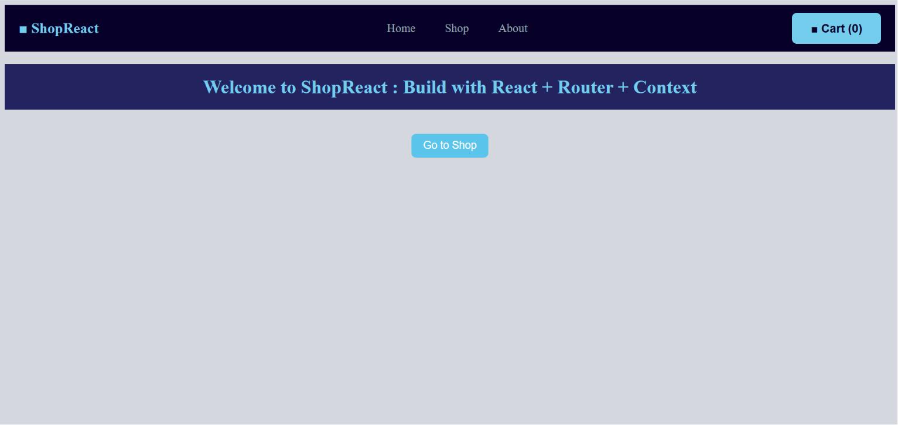
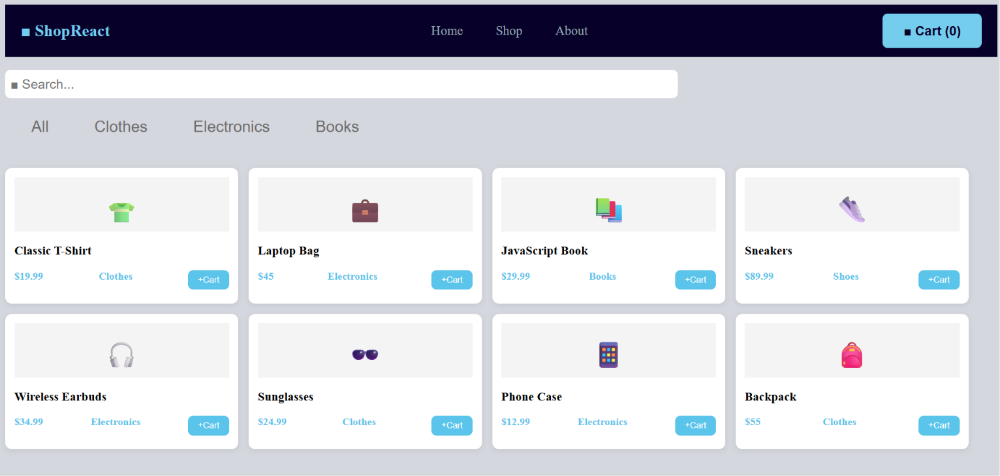
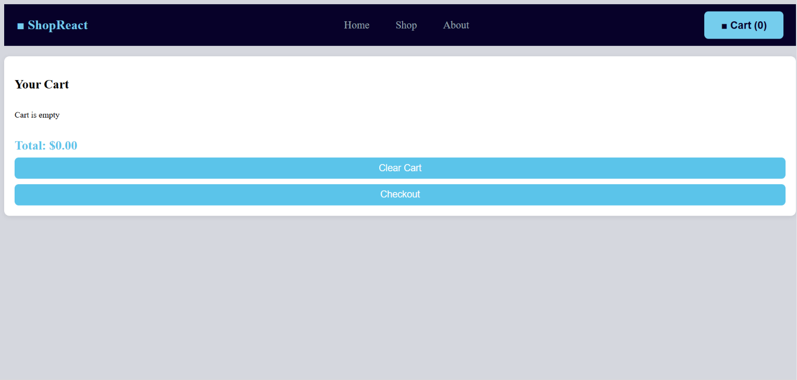
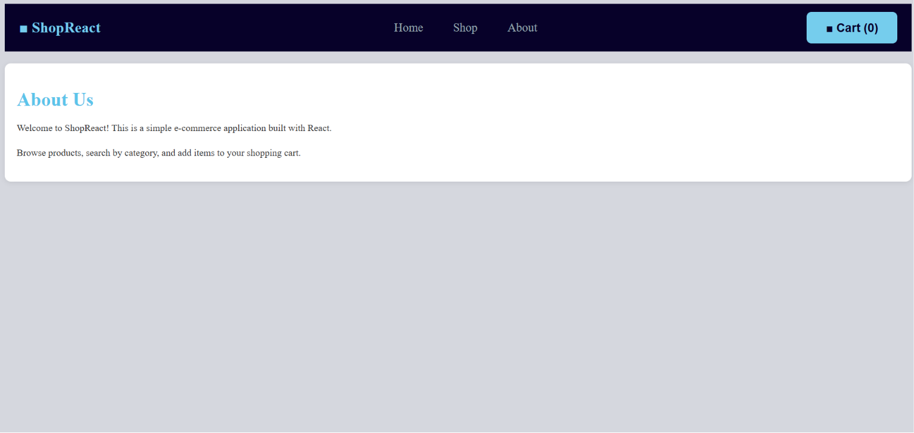

# 🛒 ShopReact — Modern E-Commerce Application

## 📸 Screenshots

### 🏠 Home Page



---

### 🛍️ Shop Page



---

### 🛒 Shopping Cart



---
### 🛍️ About Page



---

### ℹ️ About Page


A fully responsive e-commerce web application built with **React + Vite**, implementing modern React concepts such as **Components, Props, Hooks, React Router, and Context API**.

This project was built as a complete learning journey from a basic React app into a scalable shopping experience with cart management, filtering, routing, and persistent data storage.

---

## ✨ Features

### 🏠 Home Page

* Modern hero section
* Welcome message
* Call-to-action shopping button
* Responsive layout

### 🛍️ Shop Page

* Display products dynamically from data
* Product cards component architecture
* Live search functionality
* Category filtering
* Responsive product grid

### 🛒 Shopping Cart

* Add products to cart
* Increase quantity automatically
* Remove items
* Clear cart
* Calculate total price
* Cart counter in navbar
* Persistent cart using localStorage

### 📄 Additional Pages

* Home
* Shop
* Cart
* About

### ⚡ React Features Used

* Functional Components
* JSX
* Props
* useState
* useEffect
* Context API
* Custom Hooks
* React Router

---

## 🧱 Project Structure

```
src/
│
├── components/
│   ├── Navbar.jsx
│   ├── ProductCard.jsx
│   └── CartItem.jsx
│
├── pages/
│   ├── HomePage.jsx
│   ├── ShopPage.jsx
│   ├── CartPage.jsx
│   └── AboutPage.jsx
│
├── context/
│   └── CartContext.jsx
│
├── data/
│   └── products.js
│
├── App.jsx
├── main.jsx
└── index.css
```

---

## 🚀 Technologies

| Technology      | Usage                   |
| --------------- | ----------------------- |
| React           | Frontend library        |
| Vite            | Development environment |
| React Router    | Client-side navigation  |
| Context API     | Global cart state       |
| JavaScript ES6+ | Application logic       |
| CSS3            | Responsive styling      |
| LocalStorage    | Data persistence        |

---

## 📦 Installation & Setup

Clone the repository:

```bash
git clone https://github.com/your-username/shop-react.git
```

Navigate to the project folder:

```bash
cd shop-react
```

Install dependencies:

```bash
npm install
```

Start development server:

```bash
npm run dev
```

Open:

```
http://localhost:5173
```

---

## 🛠️ How It Works

### Product System

Products are stored inside a static data file and rendered dynamically using JavaScript `.map()`.

Each product is displayed through a reusable `ProductCard` component.

---

### Cart Management

The cart is managed globally using **Context API**.

Available actions:

* Add product
* Remove product
* Clear cart
* Calculate total items
* Calculate total price

Cart data is automatically saved and restored using `localStorage`.

---

### Routing

Navigation is handled with React Router without page reloads:

```
/
/shop
/cart
/about
```

---

## 📱 Responsive Design

The application is fully responsive and optimized for:

* Desktop screens
* Tablets
* Mobile devices

The layout adapts dynamically using modern CSS techniques.

---

## 🎯 Learning Goals

This project demonstrates understanding of:

✅ React component architecture
✅ Reusable UI components
✅ State management
✅ Data flow with props
✅ Global state with Context API
✅ Client-side routing
✅ Side effects handling
✅ Building a complete frontend application

---

## 👨‍💻 Author

Created by **Zaynab Hwayji**

Built with ❤️ using React.
